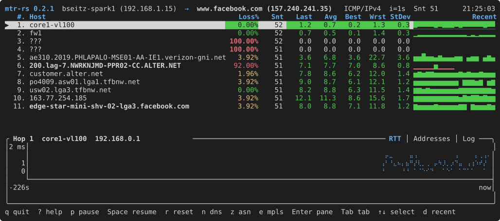
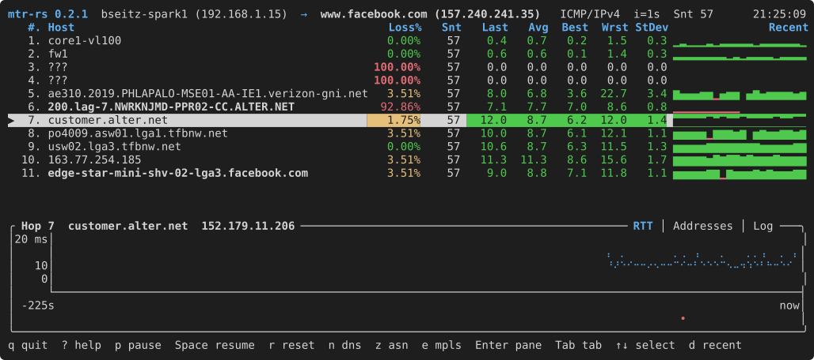

# mtr-rs

A Rust port of [mtr](https://github.com/traviscross/mtr) (My TraceRoute). Like upstream it is two
binaries: the unprivileged `mtr-rs` client and the privileged `mtr-rs-packet` helper. Both speak
the C mtr 0.96 line protocol, so each half also works with its C counterpart. The TUI is the
default; `-r`, `-w`, `-j` and `-C` give the classic reports. Linux and FreeBSD, x86_64 and
aarch64. GPL-2.0-only.

## Screenshots

## Install

    # release tarball, unpacked as mtr-rs-<version>-<arch>-<os>/
    tar xzf mtr-rs-0.2.1-x86_64-linux.tar.gz && cd mtr-rs-0.2.1-x86_64-linux
    sudo install -m 755 bin/mtr-rs bin/mtr-rs-packet /usr/local/bin/
    sudo install -m 644 man/*.8 /usr/local/share/man/man8/
    sudo setcap cap_net_raw+ep /usr/local/bin/mtr-rs-packet              # Linux
    sudo chown root:wheel /usr/local/bin/mtr-rs-packet && sudo chmod 4755 /usr/local/bin/mtr-rs-packet  # FreeBSD

    # Debian package: same files, setcap from its postinst
    sudo dpkg -i mtr-rs_0.2.1-1_amd64.deb

    # FreeBSD package: same files, mtr-rs-packet setuid root
    sudo pkg add mtr-rs-0.2.1-aarch64-freebsd.pkg

    # from a checkout, with man pages and bash/zsh/fish completions
    cargo build --release --workspace && cargo xtask dist
    sudo scripts/install.sh --no-build                # /usr/local needs root; never runs cargo
    scripts/install.sh --prefix ~/.local              # single-user: no root, builds for you
    scripts/install.sh --uninstall --prefix ~/.local  # --no-setcap, --help also exist

    # binaries only, no man pages or completions
    cargo install --path crates/mtr
    cargo install --path crates/mtr-packet
    sudo setcap cap_net_raw+ep "$(command -v mtr-rs-packet)"

Neither package declares a conflict with the distribution's `mtr`, so it can stay installed.
`--uninstall` removes exactly what it installed, given the same `--prefix`. A failing privilege
grant (`setcap`, or the FreeBSD `chmod u+s` without root) prints the command and exits 0.
`scripts/install.sh` needs bash, which on FreeBSD is `pkg install bash`.

## Usage

    mtr-rs example.org                      # interactive TUI (q quits, ? for keys)
    mtr-rs --ascii example.org              # plain glyphs (NO_COLOR honoured too)
    mtr-rs --report-on-exit example.org     # -r report when the TUI closes
    mtr-rs -r -c 5 example.org              # classic report
    mtr-rs -rwz -c 5 example.org            # wide report with AS numbers
    mtr-rs -j example.org | jq .            # C mtr's schema (array for several targets)
    MTR_RS_LOG=/tmp/mtr.log mtr-rs 1.1.1.1  # debug log (new file only, off under sudo)

Keys follow C mtr (`p`/space, `r`, `n`, `z`, `e`, `s`, `b`, `i`, `f`, `m`, `o`, `Q`, `u`/`t`, `?`);
`↑`/`↓`/`j`/`k` select a hop, `Enter` opens the detail pane, `Tab` cycles its RTT, Addresses and Log
tabs, `d` toggles the Recent sparkline.

## Configuration

The config file is optional. Write a commented starter file:

    mtr-rs --init-config          # prints the path, never overwrites
    mtr-rs --init-config -i 2 -z  # the same, with those options set

It writes the options in effect (defaults, `$MTR_OPTIONS`, command line); keys still at their
default stay commented out. `docs/config.example.toml` is that file with nothing set and documents
every key. The client reads `~/.config/mtr-rs/config.toml` (or `$XDG_CONFIG_HOME/mtr-rs/config.toml`,
or `--config PATH`) as defaults. Precedence, lowest to highest:

    built-in defaults  <  config file  <  $MTR_OPTIONS  <  the command line

An unknown key is an error; an unreadable or malformed file is fatal. For one run,
`--rtt-thresholds 30,100,200,500` and `--color auto|always|never` override the file.

## Helper and privileges

The client talks to the helper over a pipe. It tries `$MTR_PACKET`, `mtr-rs-packet` on `PATH`,
beside the running executable, `./mtr-rs-packet`, then the C `mtr-packet`.

    sudo setcap cap_net_raw+ep "$(command -v mtr-rs-packet)"
    sudo sysctl -w net.ipv4.ping_group_range="0 2147483647"   # or open ping sockets to your gid

Without `cap_net_raw` the helper falls back to unprivileged ICMP and UDP datagram sockets, which
the kernel only hands to gids inside `net.ipv4.ping_group_range`; the client names both fixes when
it cannot open its sockets. On that path TCP and SCTP probes see the final hop only: time-exceeded
replies need a raw socket.

FreeBSD has neither capabilities nor unprivileged ICMP sockets, so there the helper is installed
setuid root, as the ports `mtr` is, and drops to the invoking user once its raw sockets are open:

    sudo chown root:wheel "$(command -v mtr-rs-packet)" && sudo chmod 4755 "$(command -v mtr-rs-packet)"

`-M`/`--mark` (`SO_MARK`) and the helper's `local-device` (`SO_BINDTODEVICE`) are Linux only; the
client refuses `-M` elsewhere, and `-I` works everywhere because the client resolves the interface
to a source address itself.

The helper opens its sockets, then drops setgid, setuid and its capabilities before reading stdin.
One exception: `CAP_NET_ADMIN` is kept when the helper started with it, because `SO_MARK` is set
per probe after the drop. `-M`/`--mark` therefore needs `cap_net_admin` on the helper, and root
(or the same capability) for the client's marked route lookup. The package and `scripts/install.sh`
grant `cap_net_raw` alone, so `--mark` is opt-in:

    sudo setcap cap_net_raw,cap_net_admin+ep "$(command -v mtr-rs-packet)"

When `/etc/mtr.is.run.under.sudo` exists the client ignores `$MTR_PACKET` and `$MTR_RS_LOG`, refuses
`-F`, `--config` and `--init-config`, and does not read the default config file.

## Differences from C mtr

Deliberate differences, each with a code comment citing the C source:

- `-j` with several targets prints one JSON array; C concatenates objects into invalid JSON.
- CSV output quotes fields containing commas, quotes or newlines (RFC 4180); C never quotes.
- The helper uses the IPv4 IHL field to locate headers; C assumes 20 bytes and misparses IP options.
- Only `64:ff9b::/96` counts as the well-known NAT64 prefix; C compares just 32 bits.
- `mark` support is reported only when the helper holds `CAP_NET_ADMIN`; C claims it whenever
  `SO_MARK` was compiled in.
- `-U` below 1 and a negative `-c` are range errors; C clamps the first and accepts the second.

## Development

    cargo test --workspace                                      # unit and scenario tests
    INSTA_UPDATE=always cargo test -p mtr --test tui_snapshots   # accept screen changes
    MTR_E2E=1 cargo test -p mtr -- --ignored                     # real DNS, the installed C helper
    cargo deny check                                             # advisories, licences, sources

    cargo xtask man          # target/dist/man/
    cargo xtask completions  # target/dist/completions/ (bash, zsh, fish)
    cargo xtask dist         # both, plus a release build, under target/dist/

The upstream Python suites run unmodified against our helper. `--compare` fails only on failures
that are ours alone; `param.py` and `probe.py` want `cap_net_raw` on the C repo's listener too, and
an IPv6-capable host.

    export MTR_C_REPO=~/git/mtr MTR_PACKET=$PWD/target/debug/mtr-rs-packet
    tests/compat/run.sh cmdparse TestCommandParse   # no privileges, also runs in cargo test
    tests/compat/run.sh --compare                   # every suite vs $MTR_BASELINE
    tests/compat/run.sh --report-only probe         # same summary, always exits 0

User-visible changes go in `CHANGELOG.md` in the same commit; plans in `ROADMAP.md`.

## Releasing

1. Bump `version` under `[workspace.package]` in the root `Cargo.toml` and the two pins under
   `[workspace.dependencies]` (cargo-deny bans wildcards), run `cargo check --workspace` so
   `Cargo.lock` follows, and commit.
2. `git tag v<version> && git push --tags`; the job fails unless the tag is that version with a
   leading `v`.
3. The `release` workflow builds x86_64 and aarch64, runs `scripts/check-deb.sh` and attaches the
   tarballs and `.deb`s; `workflow_dispatch` with `dry_run: "true"` skips the release itself.

## Credits

mtr-rs was written by Bryan Seitz with assistance from Claude (Anthropic). It is a port of
[mtr](https://github.com/traviscross/mtr), created by Matt Kimball, maintained for many years by
Roger Wolff and now by Travis Cross and the mtr contributors; the protocol, the probe engine and the
report formats are theirs. Both projects are GPL-2.0-only.
